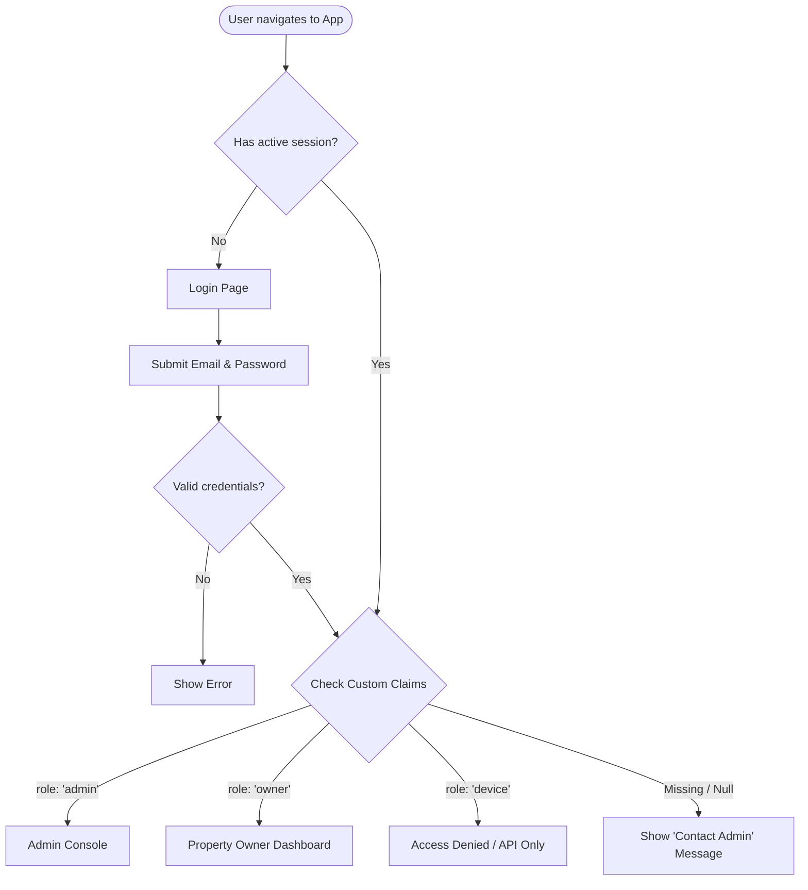
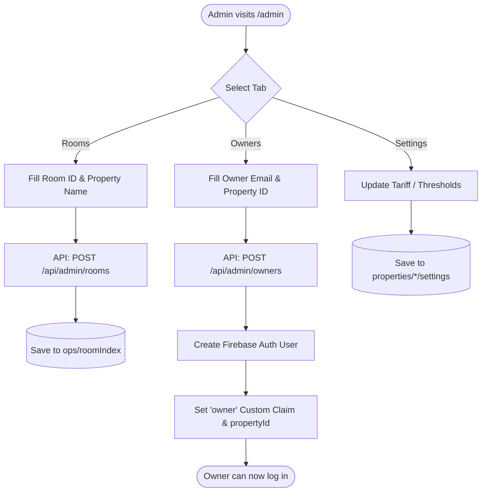
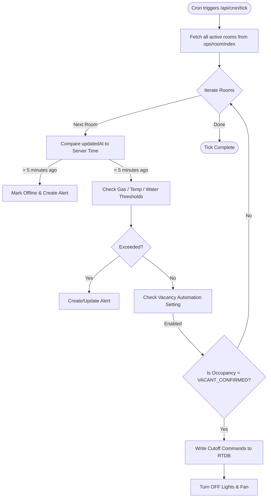

# EcoStay EMS — System Activity Diagrams

These diagrams map out the primary use cases, user flows, and automated system operations that power the EcoStay EMS platform. They are broken down by role and system boundary.

````carousel
## 1. Authentication & Role Routing
How the system authenticates users and routes them to their respective dashboards based on custom claims.



<!-- slide -->
## 2. Admin: Room & Tenancy Management
The workflow for an Administrator registering new physical rooms and granting property owners access to them.



<!-- slide -->
## 3. Owner: Dashboard & Device Control
How a Property Owner monitors their rooms and issues commands to devices (e.g., turning on the lights).

```mermaid
flowchart TD
    Start([Owner logs in]) --> FetchRooms[Read accessible properties from Firebase]
    FetchRooms --> RoomCount{How many rooms?}
    
    RoomCount -- "0 rooms" --> Empty[Show 'No property assigned' Message]
    RoomCount -- "> 1 room" --> RoomList[Show Multi-Room Selection List]
    RoomList --> PickRoom[Owner selects a room]
    RoomCount -- "1 room" --> AutoPick[Auto-select room]
    
    PickRoom --> LiveDash[Render Live Dashboard]
    AutoPick --> LiveDash
    
    LiveDash --> Monitor[Monitor Live Telemetry (occupancy, temp, power)]
    LiveDash --> Action{User Action}
    
    Action -- "Switch Tabs" --> Tabs[Navigate to Devices/Routines/Activity]
    Action -- "Toggle Device" --> Command[Click Device Switch]
    
    Command --> CheckOnline{Is room online?}
    CheckOnline -- No --> Disable[Switches are disabled]
    CheckOnline -- Yes --> WriteCommand[Write to RTDB: properties/*/rooms/*/devices/*]
    
    WriteCommand --> FirmwarePoll[Firmware polls RTDB every 500ms]
    FirmwarePoll --> Relay[Firmware flips physical relay]
```

<!-- slide -->
## 4. System Automation: The 1-Minute Tick
The automated Cron job (Vercel + cron-job.org) that evaluates offline statuses, thresholds, and runs the Vacancy-Cutoff automation.



<!-- slide -->
## 5. System Automation: Nightly Rollup (Cost & Savings)
The nightly job that aggregates 5-minute telemetry samples into daily summaries, calculates savings, and prunes old data.

```mermaid
flowchart TD
    Start([Cron triggers /api/cron/rollup at 00:05]) --> FetchSamples[Fetch previous day's 5-minute samples]
    
    FetchSamples --> Aggregate[Calculate Total kWh Used (Peak/Day/Off-Peak)]
    Aggregate --> CalcSavings[Calculate avoidedKWh]
    
    CalcSavings -->|Formula| Wattage[Wattage × Confirmed-Vacant Time]
    Wattage --> WriteDaily[Write DailyAggregateView to RTDB]
    
    WriteDaily --> Prune[Delete raw 5-min samples older than 30 days]
    Prune --> Bill[Dashboard calculates month-to-date Bill based on Daily Aggregates]
    
    Bill --> Finish([Rollup Complete])
```
````
